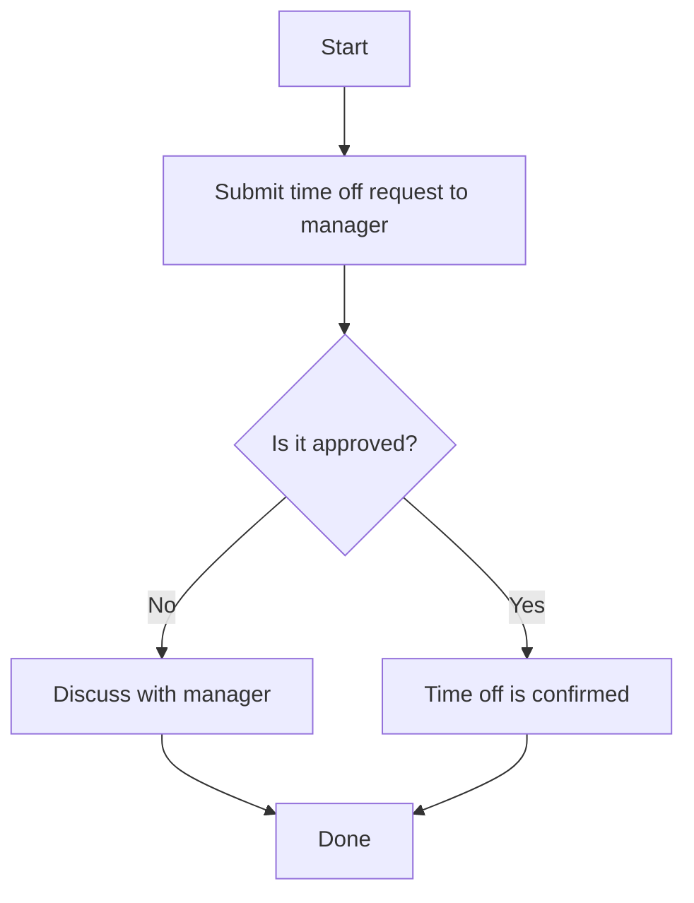

## HR Policies

This page outlines Acme Corp's core HR policies for all employees. If you have questions about any policy, contact HR at <sysadmin@acme.com>.

### Time Off

Full-time employees receive 15 days of paid time off (PTO) per year. To request time off:

- Submit your request to your manager at least two weeks in advance.
- Your manager will review and approve or deny your request.
- Once approved, your time off will be logged in the employee portal.

### Remote Work

Acme Corp supports flexible work arrangements for eligible roles. To request remote work:

- Submit a formal request to your manager.
- Your manager will evaluate if your role is eligible for remote work.
- If approved, you will receive remote work guidelines from HR.

The following diagram shows the process for submitting a time off request at Acme Corp.

