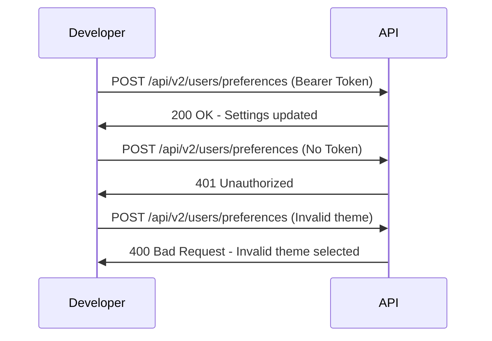

## API Overview

This page documents the Acme Corp User Profile API (v2). Use this API to update user profile settings, including theme preferences and notification settings.

**Base URL:** `POST /api/v2/users/preferences`

## Authentication

All requests to this API require authentication using a Bearer Token.

To authenticate, include your token in the request header:

```bash
Authorization: Bearer 
```

If you do not include a valid token, your request will be rejected.

## Request Parameters

| Parameter | Type | Required | Description |
| --- | --- | --- | --- |
| `theme` | string | Yes | Sets the user's theme. Valid values: `light`, `dark`, `system`. If you enter an invalid value like `high-contrast`, the API returns an error: "Invalid theme selected." |
| `notifications_enabled` | boolean | Yes | Enables or disables notifications. Set to `true` to enable or `false` to disable. |

## Code Samples

### Successful Request

```json
{
  "theme": "dark",
  "notifications_enabled": true
}
```

### Success Response (200 OK)

```json
{
  "status": "updated",
  "timestamp": "2026-05-20T10:00:00Z"
}
```

### Error Response (400 Bad Request)

```json
{
  "error": "Invalid theme selected."
}
```

## API Flow

The following diagram shows the API request and response flow.


