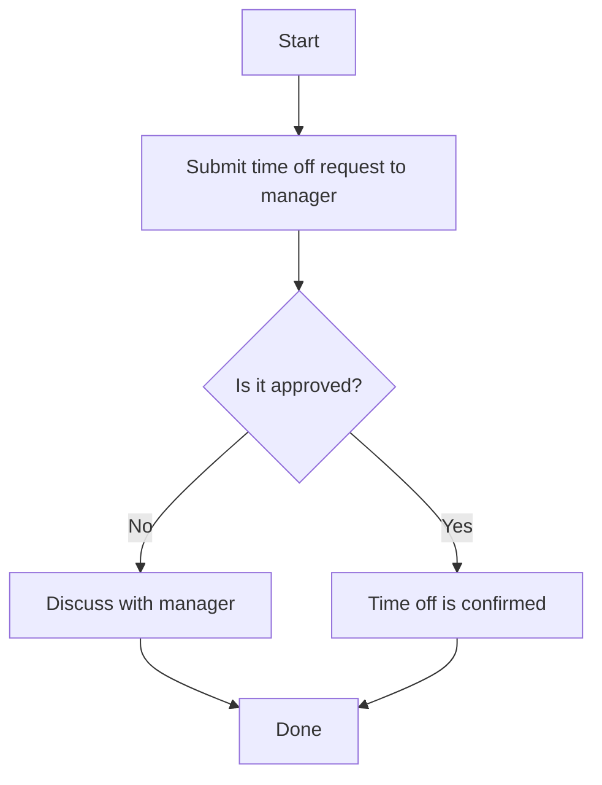

## HR Policies

This page outlines Acme Corp's core HR policies for all employees.

### Time Off

- Full-time employees receive 15 days of paid time off per year.
- Submit time off requests to your manager at least two weeks in advance.

### Remote Work

- Employees may request to work remotely by submitting a formal request to their manager.
- Your manager will evaluate if your role is eligible for remote work.

